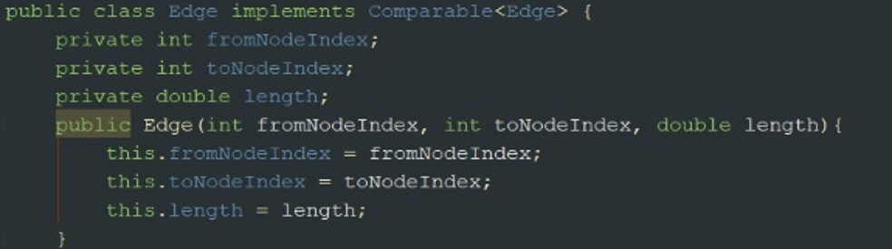
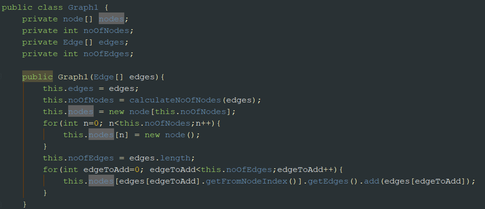
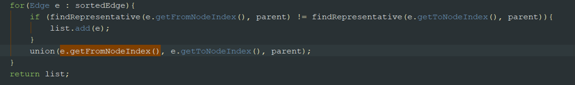
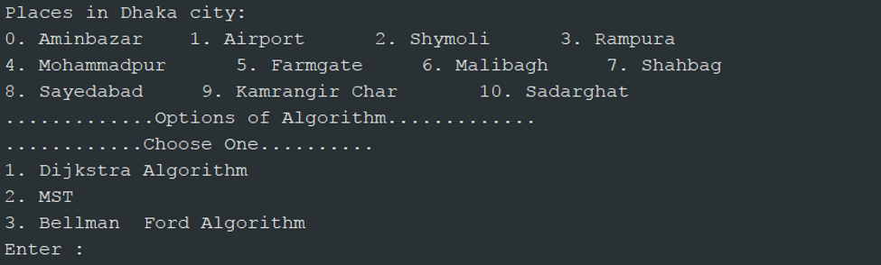
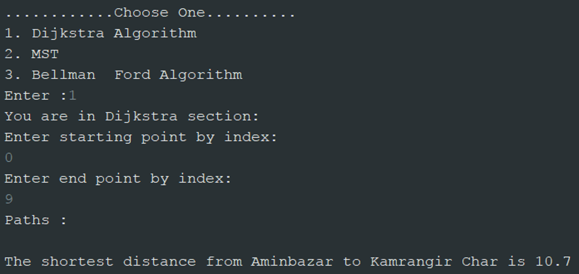
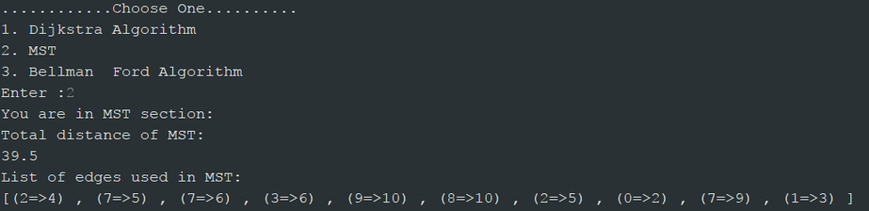
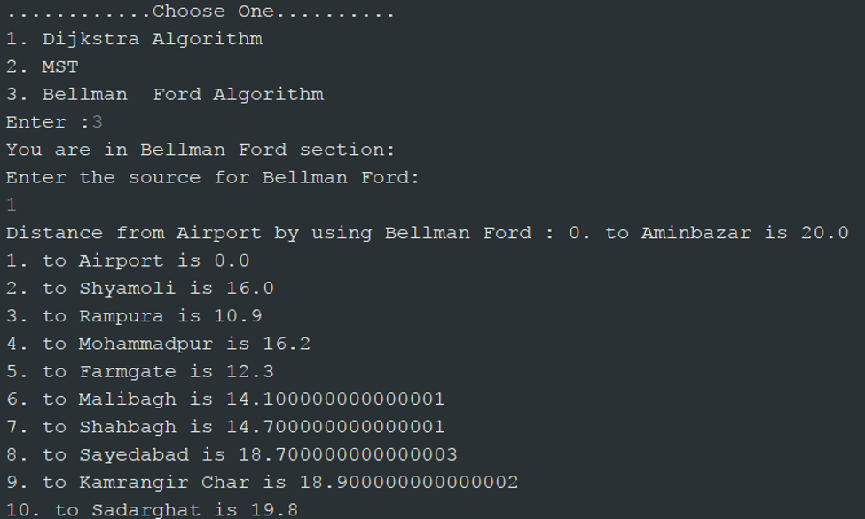

**This is my Fall-2017 Algorithm course project.**
# Route-Planner
This app will help one to choose route wisely for his destination. Implemented in Java.

Route planner means the planning application of one’s route. This app will help one to choose route wisely for his destination.
This application take one’s start point and end point of any journey. For this we selected some places in Dhaka city. If one wants to travel in those places he will find beneficial of this application. We took 11 places as model in our application.
1.	Aminbazar
2.	Airport
3.	Syamoli
4.	Rampura
5.	Mohammadpur
6.	Farmgate
7.	Malibag
8.	Shahbag
9.	Sayedabad
10.	Kamrangir Char
11.	Sadarghat
 
To run this application properly, we implemented three main algorithm.
1. Dijkstra’s Shortest Path
2. Minimum Spanning Tree (MST)
3. Bellman Ford

These algorithms were implemented in JAVA. Before describing the algorithms, it’s better to describe about Graph. We needed a graph to implement these algorithms.
Graph
A graph has some vertices and edges. Vertices as place in Dhaka city and edges as paths among them.
For this, we take some edges as class Edge containing from place, to place and distance between them.
Our program converted them into graph.

 
                                  Code of Graph
These codes make an ArrayList of Edge type into a graph.

 Now describing about these algorithms.

Dijkstra
This algorithm is the main part of our application. This algorithm takes one start place and one destination. Then calculate the shortest path distance from the start place to end place. By this algorithm we can calculate shortest distances from any vertex to all other vertices in graph.

 

Minimum Spanning Tree
This algorithm gives us the minimum cost of travelling all places. Means if one wish to travel all places, then this algorithm gives him/her the routes by he/she can travel at minimum cost. For our graph…

 
Bellman Ford
This algorithm is for bad connection in one rout. If there is negative cost of one edge then Dijkstra can not handle it. Then we need the Bellman Ford Algorithm.
 

In our project

 
Places as index and options to choose.
For Dijkstra:
 
 
These is the output. Shortest distance from source to destination.
For MST:

 
The given edges are used in MST.
For Bellman Ford:

 
This part is giving distance from source to destination using Bellman Ford Algorithm.
